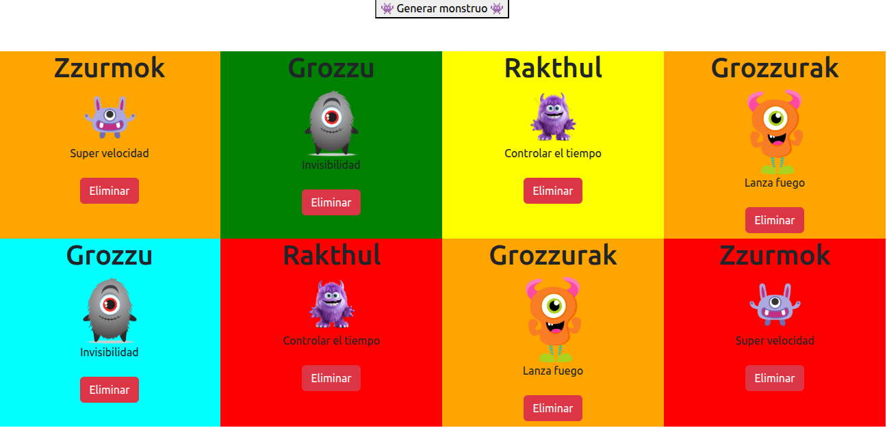

# 👾 Proyecto: Creador de Monstruos

Esta es una aplicación interactiva para **crear y personalizar monstruos**, desarrollada con HTML, CSS y JavaScript. El enfoque principal está en la manipulación del DOM y la generación dinámica de contenido visual.

---

## 🚀 Funcionalidades

- Generar monstruos aleatorios con diferentes características  
- Eliminar monstruos creados  
- Animaciones y diseño visual divertido

---

## 🧠 Tecnologías utilizadas

- **HTML5** – para la estructura básica de la aplicación  
- **CSS** – para los estilos, animaciones y diseño responsivo  
- **JavaScript (DOM)** – para la lógica de creación, personalización y control de eventos  

---

## 📂 Estructura del proyecto
